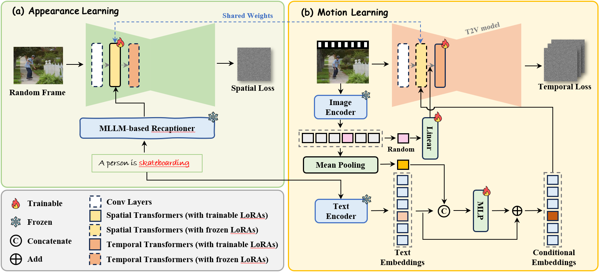
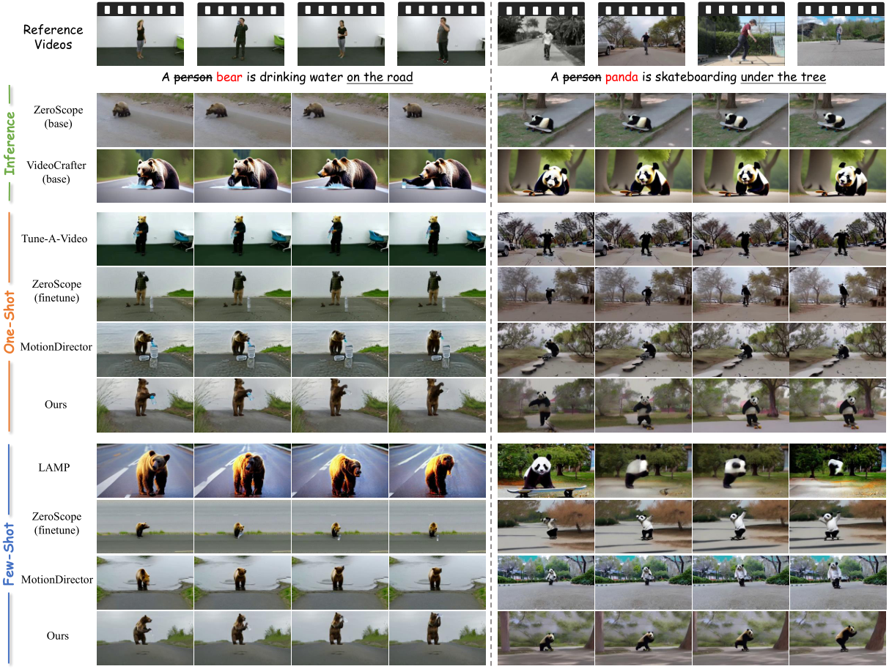

## MoTrans: Customized Motion Transfer with Text-driven Video
[[Paper](https://openreview.net/pdf?id=rLw5583hMb)] 

## News
- **[2024.09.30]**: Release **datasets**!

* More results can be found in our [Paper](https://openreview.net/pdf?id=rLw5583hMb).

## Dataset
We collect a dataset that includes 12 distinct motion patterns, sourced from the Internet, the UCF101 dataset, the UCF Sports Action dataset, and NTU RGB+D 120. Each motion pattern is represented by approximately 4-10 training videos. The dataset consists of various sports motions, such as weightlifting and golf swing, alongside large-scale limb movements like waving hands and drinking water.

### TODOs
- [ ] Release training and inference code
- [ ] Release project page.

